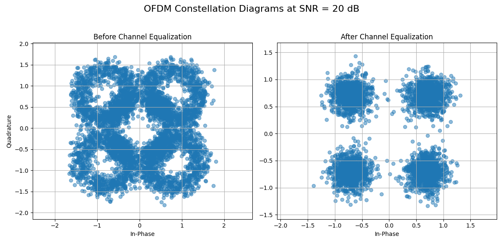

# Simulation of an OFDM System with Multipath Channel Equalization

This project implements a basic Orthogonal Frequency-Division Multiplexing (OFDM) communication system in Python. It simulates the entire signal chain, from the transmitter's IFFT processing to the receiver's frequency-domain equalization, which is essential for combating multipath fading.

The simulation visually demonstrates how OFDM, the core technology behind 4G LTE and 5G, can effectively overcome channel distortions to enable reliable high-speed wireless communication.



---

## Core Concepts 📶

* **OFDM (Orthogonal Frequency-Division Multiplexing):** A modulation technique that splits a high-rate data stream into multiple lower-rate streams, which are then transmitted in parallel on different orthogonal subcarriers. This makes the system highly resilient to multipath fading.

* **Multipath Fading:** In a wireless environment, signals reflect off objects (buildings, walls, etc.), creating multiple "echoes" that arrive at the receiver at different times. This causes severe inter-symbol interference (ISI), which corrupts the signal. The "Before Equalization" plot shows the effect of this phenomenon.

* **IFFT / FFT (Inverse/Fast Fourier Transform):** The mathematical heart of OFDM.
    * At the transmitter, the **IFFT** efficiently combines the data from all subcarriers into a single time-domain signal for transmission.
    * At the receiver, the **FFT** performs the reverse operation, perfectly separating the received time-domain signal back into its individual subcarrier components.

* **Cyclic Prefix (CP):** The key innovation that makes OFDM robust. A copy of the end of each OFDM symbol is attached to its beginning. This guard interval serves two purposes:
    1.  It absorbs ISI from the previous symbol, protecting the current symbol's integrity.
    2.  It preserves the orthogonality of the subcarriers, which is essential for the FFT to work correctly.

* **Frequency-Domain Equalization:** While multipath distortion is complex in the time domain, it becomes a simple multiplication at each subcarrier in the frequency domain. The receiver can therefore correct this distortion with a simple **per-subcarrier division**, which is computationally very efficient. This is the step that "cleans up" the constellation, as seen in the "After Equalization" plot.

---

## How It Works ⚙️

The simulation models the key steps of an OFDM system:

### Transmitter

1.  **Bit Generation & Modulation:** A stream of random bits is generated and modulated into QPSK symbols.
2.  **Subcarrier Mapping:** The QPSK symbols (data) and known pilot symbols are mapped to their assigned frequency-domain subcarriers.
3.  **IFFT:** The `ifft` function is applied to transform the frequency-domain signal into the time domain.
4.  **Cyclic Prefix Addition:** The end of the time-domain signal is copied and prepended to the beginning to create the final OFDM symbol.

### Channel

1.  **Multipath Fading:** The transmitted signal is convolved with a predefined channel impulse response to simulate multipath effects.
2.  **AWGN:** Random Gaussian noise is added to the signal based on the specified Signal-to-Noise Ratio (SNR).

### Receiver

1.  **Cyclic Prefix Removal:** The CP is identified and discarded from the received signal.
2.  **FFT:** The `fft` function is applied to transform the time-domain signal back into the frequency domain, separating the subcarriers.
3.  **Channel Equalization:** The channel's effect is estimated (in this simulation, we assume perfect knowledge for simplicity). The received symbol on each subcarrier is then divided by the channel's frequency response at that subcarrier's frequency. This corrects the distortion.
4.  **Demodulation:** The equalized QPSK symbols are demodulated back into bits.

---

## How to Run

### Prerequisites

You will need the following Python libraries:
* `numpy`
* `matplotlib`

You can install them using pip:
```bash
pip install numpy matplotlib
```

### Execution

To run the simulation and generate the constellation plots, execute the script from your terminal:
```bash
python ofdm_simulation.py
```
The script will display a figure with two subplots, showing the received signal constellation before and after the equalization process.
